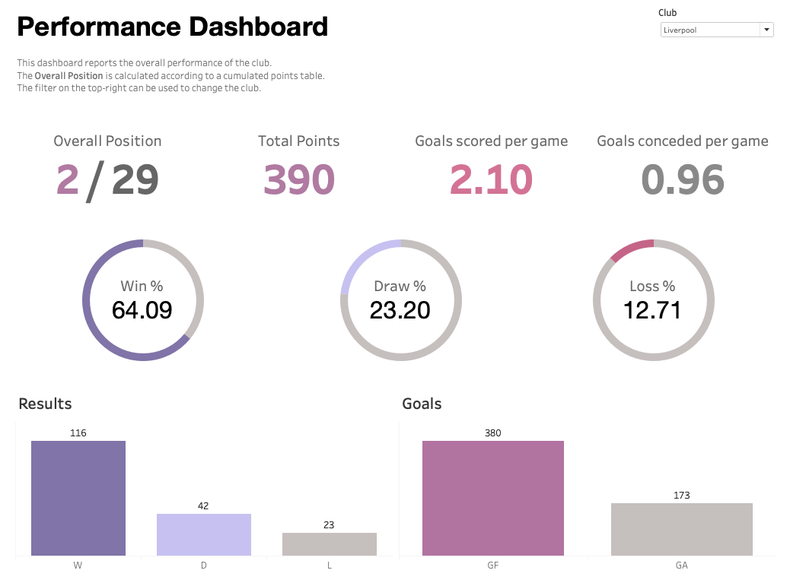
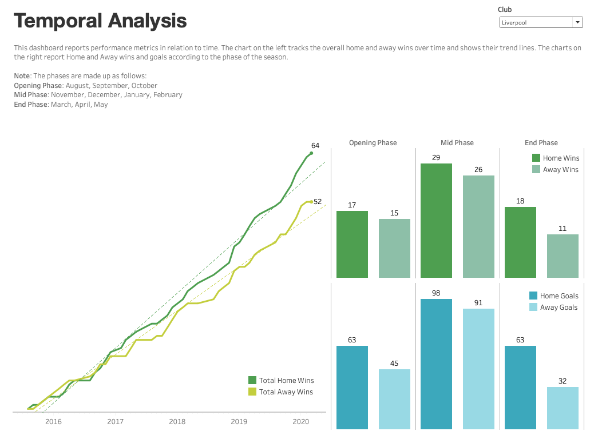

# Premier League Dashboards

## Tools Used
```
Tableau Public (Desktop Edition) 2020.4.2 (20204.21.0217.1203) 64-bit
```

## Dashboards
I have developed two dashboard concepts which visualise club performances.

**The Performance Dashboard** provides a top-level view of the club's performance and focuses on the results and goals. It includes the following metrics:

- Overall Position: This is calculated according to the [accumulated points table](data/table.csv)
- Total Points
- Goals Scored per game
- Goals conceded per game
- Win/Draw/Loss percentage
- Win/Draw/Loss frequency
- Number of goals scored
- Number of goals conceded

**The Temporal Analysis Dashboard** introduces the temporal element and analyses club performance over time. It has two main sections:

- The left-side visualises the number of home and away wins over the years and provides trend lines for both. There are interesting insights within this graph where the two lines intersect or move away from each other.
- The right-side visualises home/away wins and goals scored according to the phase of the season. I think this temporal aspect is often overlooked when analysing a club's performance, and can provide interesting insights.

I have determined the phases as follows:

- Opening phase: August, September, October
- Mid Phase: November, December, January, February
- End Phase: March, April, May





## Design Thinking
The design of both the dashboards follows a minimalist and clean approach. This increases the responsiveness, accessibility and readability of the dashboards and assists in quick analysis.

The Performance Dashboard employs a soft pink/purple palette while greying out things that are either hardcoded (the number of total teams) or refer to a negative metric (losses and goals conceded).

The Temporal Analysis Dashboard employs a green/blue palette, differentiating between home/away through tints, and results/goals through colour.

## Functionality
For the overall functionality of the dashboards, there is a filter on the top-right which has a list of all the clubs. All the visualisations follow that filter. There is also an 'All Clubs' option within the filter which can be selected to show the overall performance of the Premier League.

For the individual charts and graphs, there are hovering functionalities which present additional information when hovering over a particular visualisation. These can be customised to a great extent.

## Future Ideas
I have a few ideas to work on in the future:

- A third dashboard that can compare the performance of two or more clubs.
- Clean-Sheet metrics for individual clubs and the overall league.
- Comeback and Throwaway metrics for individual clubs.
- Explore variants of how the season can be divided into phases and add it as a functionality where the user can pick the division through a filter.

The clean-sheet, comeback, and throwaway statistics are already part of the [analysis](analysis.md) and will only need to be turned into a dataset and brought into a visualisation software.